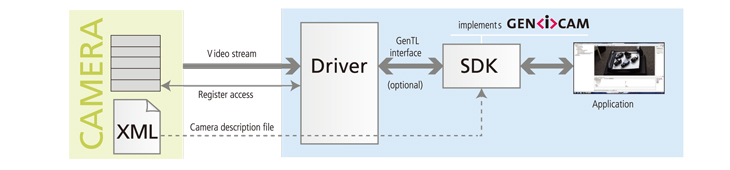

# GeniCam

参考情報

[**GenICam GenApi 2.1.1 (PDF)**](https://www.emva.org/wp-content/uploads/GenICam_Standard_v2_1_1.pdf) 

[**GenICam SFNC 2.7 (PDF)](https://www.emva.org/wp-content/uploads/GenICam_SFNC_v2_7.pdf)** 

GenICam(Generic Interface for Cameras)の目標は、あらゆるデバイス（主にカメラ）に、インターフェース技術（GigE Vision、USB3 Vision、CoaXPress、Camera Link HS、Camera Linkなど）や実装機能に関係なく、汎用プログラミングインターフェースを提供することです。その結果、インターフェース技術に関わらず、アプリケーションプログラミングインターフェース（API）は同一になります。



**GenApi/SFNC/GenTL**


## 1.1 カメラで汎用プログラミングインターフェースってどういうこと？

カメラはベンダーごとに”シャッター切る”、”カメラのゲイン(イメージセンサの感度(明るさ調整))”のプログラムから操作しようとするとやり方がちがうんです。最終的にはレジスタアドレスへデータ書き込みになるので、ゲインの設定とかは次のように書けるのですが、ゲインのアドレスが”0x0815”かはベンダーごとに違います。

```rust
　WriteRegister( 0x0815, 0x2A, 2 ) // address, data, length
```

GeniCam使うと、ベンダーによらずにこういう書き方ができます。

```rust
Camera.Gain = 42;
```

## 1.2 画像とるならわざわざGeniCamいらんのでは

あっています。例えばOpenCV使ったことある人なら適当なWebカメラ使ってcv::VideoCaptureで画像取れますよね。


OSごとにカメラのAPIがV4L2, DirectShow, MediaFoundationという感じでありまして、cv::VideoCaptureのAPIの後ろに隠ぺいしてくれているので画像処理アプリケーションは同じコードでカメラから画像を取得できます。だけど、カメラの制御は難しいです。例えば、前の節で例に出したゲイン制御は難しいです。OpenCVは画像を取ること、画像の処理をPC上で行うことに特化しています。

## 1.3 カメラで画像を取る以外になにをすることがあるの

GeniCamは産業用カメラ向けに作られた規格です。産業用カメラは工場でラインを流れる製品の欠陥、傷を検出してラインから弾いたり、産業用ロボットと組み合わせて物を運んだり組み立てたりするときのセンサーとして使われます。

その一例でラインカメラというものがあります。エリアカメラという平面を撮影するカメラだと照明ムラなどによって安定した画像が取れないという問題があります


参考情報:[ラインスキャンカメラってなんだ？](https://www.keyence.co.jp/landing/req/vision/cv-x_1097_03.jsp)

これ実はとんでもなく便利でして色々な工場で使われています。ベアリングやギアだけでなく、とんでもなく大きなロール状のものは大きな板材の撮影に使われます。理屈は単純でモノを動かす速度に合わせてシャッターを切ればいいんです。ただ、シャッタータイミング、露光、トリガー制御、動作速度を考慮した設定が必要なんです。
ラインカメラのほかに3Dカメラや照明と使って傷を浮き出させるようなカメラもあったりして多様な設定項目があります。

## 2.1 GeniCamの存在意義

各社は画像解析のソフトやプログラムを持っているんですが(※)、この設定方法がカメラごとに違うとラインの入れ替えなど保守で難儀していました。そこでという的に書けるようにGeniCamが整理されたという流れです。

■GeniCam以前の露光時間100ms設定

```rust
if (メーカーA) {
　　　cameraA.setExposure(100);
} else if (メーカーB) {
　　　cameraB.configureExposure(0.1);
}
```

**メーカーごとに制御ソフトやSDKがバラバラ**で、開発者は **カメラごとに別のコードを書く必要**がありました。

■GeniCam以降の露光時間100ms設定

```rust
cameraA.setExposure(100);
```

GeniCam対応のカメラとSDKを用いれば**どのメーカーでも同じ関数で制御**できるようになります。EMVA(欧州マシンビジョン協会)によって策定された国際規格です。
※ISOがマシンビジョンなんてニッチなものがよくわからんので業界の主要企業が入っているEMVAが実質的に規格作っているということらしいです。将来ISOに入るかもはしれません

(※)
各社では以下のようなソフト使って画像処理をしています。**HALCON/VisionPro/LabVIEW/OpenCV/NeuroCheck/Common Vision Blox/Matrox Imaging Library (MIL)**

## 2.2 どうやって共通のAPIを実現している？

**GenApi**:カメラの機能や設定をXML記述で公開し、APIでアクセスできるようにする規格

**SFNC** (Standard Features Naming Convention):「露光時間」「ゲイン」など、共通機能の命名と構造の標準化

が規格で定められており、それに準拠した各社SDKやGeniCam標準団体が作成したリファレンス実装を使用できます。

**SFNCの例**


Widthはイメージセンサーから取り出す映像の幅を示すデータ。下のようなイメージ。


各項目の説明

- Category:フィーチャーがどのフィーチャーグループに属するかを定義する。GUIが機能をより整理された形で表示できるようにすることを目的に定められる
- Lvele:要件レベル
    - Mandatory: GenICam 標準に準拠するために実装必須です。かなり少ない。RootやDeviceとかくらい
    - Recommended:この機能はユースケースに重要な要素に用いる。カメラとして機能するために必要なものに大体付く
    - Optional:任意。
- Interface:GenAPIで設定を表現するための項目。Intger、Float, Enum, Bool, Commandがある。
- Visibility:その設定をいじれる人の想定。Beginner/Expert/Guru/Invisibleがある。提供するGUIの設定画面が対象とするユーザーレベルで意図されていない情報が表示されないために利用したりする。ちなみにGuruの項目を下手に弄ると撮像自体もできなくなる。InvisibleはGUIからは触れないけどAPIから触れるとか。
- Values:値の範囲。ただ、実際は他Featureとの関連があったりする。


各カメラメーカはXMLファイルをカメラに格納しています。これに、どういうフィーチャがどこのレジスターに関係するかということが収められていて、それをSDKが読み込んで、GenAPIで触れる形式にします。

XMLの例


GainというFeatureのレジスタアドレスとかが書かれている。このXMLから以下のようなツリーがつくられており。


```cpp
void setCameraGain(Device* device, int gainValue)
{

INodeMap* pNodeMap= pDevice->GetGenApiMap();
CInteger* pGain = dynamic_cast<CInteger*>(params->Get("Gain"));
if (pGain->IsAvilable() && pGain->IsWritable()) {
    int min = pGain->GetMin();
    int max = pGain->GetMax();
    
    if (gainValue < min) gainValue = min;
    if (gainValue > max) gainValue = max;
    
    pGain->SetValue(1000);
}
```

## 2.3 応用 IsAvilableとか？IsWritableとか？GetMin/GetMinって何？

実際にアプリーケーションから制御するにあたって現実な問題がある。カメラ側の都合でその値が今は使用できない。今は書き込めない。最小値、最大値がどうしてもある。それをGenAPIでは扱えるようにしている。
※今は使用できないとは？例えば、先ほどのラインカメラの設定は多くのカメラはあるFeatureをラインカメラモードに変更していないと触れない。カラーとモノクロを切り替えれるカメラならモノクロ時はカラー関係の設定がAvailable Flaseになる。GUIアプリとかだとトグルスイッチとかでモノクロにするとカラーの設定項目がグレーアウトさせたりもできる。

IsAvilable/IsWritableといいったアクセサビリティの例

産業用カメラにはTriggerという外部機器からのトリガーを受け取ってシャッターを切る機能があります。この外部信号のエッジの上がり/下がりのいずれをシャッターの契機にするかをTriggerPolarity で設定できますが、当然Triggerが自体が無効な場合は読み書き不可にしたいです。こういうときはTriggerPolarity にTriggerEnabledをpAvailableとしてつけています。


```cpp
<IntSwissKnife Name="TriggerEnabled">
  <ToolTip>Determines if the Trigger feature is switched on</ToolTip>
  <pVariable Name="TRIGGER">TriggerReg</pVariable>
  <Formula>TRIGGER==1</Formula>
</IntSwissKnife>
```

GetMin/GetMinの範囲チェックとキャッシュ


```cpp
0 <= Left   <= ImagerWidth - Width 
0 <= Top    <= ImagerHeight - Height
1 <= Width  <= ImagerWidth - Left
1 <= Height <= ImagerHeight - Top
```


各値の下にIntSwissKnifeノードがあってそこから最大値を取っている。

SwissKnifeはGenICam内で数学的な計算を行うためのノードでIntとFloatがある。SwissKnifeでは以下のようなXML定義をすることで計算も定義できる。

```cpp
<IntSwissKnife Name="WidthMax">
   <pVariable Name="X">Left</pVariable>
   <pVariable Name="Y">ImageHeight</pVariable>
   <Formula>Y-X</Formula>
</IntSwissKnife>
```

3. VSS（Vehicle Signal Specification）とは似ているようだけど違う？

VSSでは車両内のさまざまな信号（速度、位置、画像など）を**統一的な名前と構造**で定義しており、JSONでツリー上に表現しているのは似ている。

| 項目 | GeniCam | VSS |
| --- | --- | --- |
| **目的** | カメラの制御・パラメータへの抽象的アクセスを可能にする（API化） | 車両内のさまざまな信号（速度、位置、画像など）を**統一的な名前と構造**で定義する |
| **対象範囲** | カメラ固有のノード（Gain, ExposureTime, ROI など） | ECU、センサ、アクチュエータなどが生成する全信号（速度、燃料量、LIDAR点群なども含む） |
| **構成方法** | XMLでノードツリーを定義し、SDKが読み取り制御 | JSON構造でツリー化されたセマンティクス（例：`Vehicle.Speed`, `Body.Lights.LowBeam.IsActive`） |
| **標準の定義元** | EMVA (European Machine Vision Association) | COVESA（旧GENIVI：車載オープンプラットフォーム推進団体） |
| **主な用途** | 産業用カメラ、画像検査、自動化 | 車両のデータアクセス（アプリ開発、クラウド連携、ログ解析） |
| **通信との関係** | GenTL、GigE Vision、USB3 Vision などの通信規格と連携 | CAN, SOME/IP, MQTT, VSS over DDS などと組み合わせ可能 |

チャットGPT曰く:VSS Extension
[https://covesa.github.io/vehicle_signal_specification/extensions/index.html](https://covesa.github.io/vehicle_signal_specification/extensions/index.html)

```cpp
Vehicle:
  Speed:
    type: float
    unit: km/h
    accessibility:
      available: Signal.Availability.VehicleSpeed  # ← 別信号で制御
```